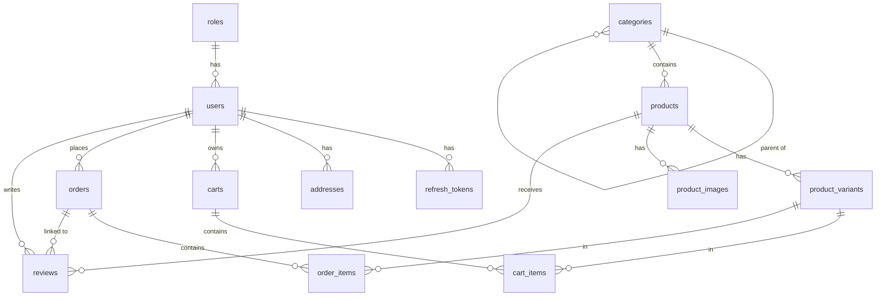

# Database Documentation

## Overview

| Property | Value |
|----------|-------|
| Database | MySQL 8.x |
| ORM | TypeORM (NestJS integration via `@nestjs/typeorm`) |
| Architecture | Feature-based — entities owned by the feature that manages them |
| Connection pool | Default TypeORM pool (min: 2, max: 10 — tune per load profile) |
| Timezone | All timestamps stored in UTC |
| Charset | `utf8mb4` (required for emoji and full Unicode support) |

### Naming Conventions

| Element | Convention | Example |
|---------|------------|---------|
| Tables | `snake_case`, plural | `users`, `order_items`, `product_variants` |
| Columns | `snake_case` | `created_at`, `user_id`, `token_hash` |
| Primary Keys | `id BIGINT AUTO_INCREMENT` | `id` |
| Foreign Keys | `{singular_ref_table}_id` | `product_id`, `cart_id`, `user_id` |
| Indexes | `idx_{table}_{column(s)}` | `idx_users_email`, `idx_orders_user_id_status` |
| Join tables | `{table_a}_{table_b}` | `user_roles`, `product_tags` |

---

## Entities by Feature

### Auth Feature

Owns: `roles`, `users`, `refresh_tokens`

**roles**

| Column | Type | Constraints | Notes |
|--------|------|-------------|-------|
| id | BIGINT | PK, AUTO_INCREMENT | |
| name | VARCHAR(50) | NOT NULL, UNIQUE | e.g., `customer`, `admin` |

**users**

| Column | Type | Constraints | Notes |
|--------|------|-------------|-------|
| id | BIGINT | PK, AUTO_INCREMENT | |
| role_id | BIGINT | FK → roles, NOT NULL | Role-based access control |
| email | VARCHAR(255) | NOT NULL, UNIQUE | Indexed — login lookup |
| password_hash | VARCHAR(255) | NOT NULL | bcrypt hash, never plain text |
| full_name | VARCHAR(100) | NOT NULL | |
| phone | VARCHAR(20) | NULLABLE | |
| is_active | BOOLEAN | NOT NULL, DEFAULT TRUE | Soft disable — not soft delete |
| created_at | DATETIME | NOT NULL, DEFAULT CURRENT_TIMESTAMP | TypeORM `@CreateDateColumn` |
| updated_at | DATETIME | NOT NULL, AUTO-UPDATE | TypeORM `@UpdateDateColumn` |

**refresh_tokens**

| Column | Type | Constraints | Notes |
|--------|------|-------------|-------|
| id | BIGINT | PK, AUTO_INCREMENT | |
| user_id | BIGINT | FK → users, NOT NULL | Token owner |
| token_hash | VARCHAR(255) | NOT NULL, UNIQUE | SHA-256 hash of raw token |
| device_name | VARCHAR(100) | NULLABLE | e.g., `"Chrome on Windows"` |
| ip_address | VARCHAR(45) | NULLABLE | Supports IPv4 and IPv6 |
| user_agent | VARCHAR(255) | NULLABLE | Browser or app identifier |
| expires_at | DATETIME | NOT NULL | Hard expiry — checked on every use |
| is_revoked | BOOLEAN | NOT NULL, DEFAULT FALSE | Soft revoke flag for logout |
| created_at | DATETIME | NOT NULL, DEFAULT CURRENT_TIMESTAMP | |

> **Security note:** Raw refresh tokens are never stored. The `token_hash` column stores a SHA-256 hash of the token delivered to the client. Lookup is performed by hashing the incoming token, never by plaintext comparison.

> **Operational note:** Schedule a periodic cleanup job to `DELETE FROM refresh_tokens WHERE expires_at < NOW() OR is_revoked = TRUE`. This prevents unbounded table growth.

---

### User Profile Feature

Owns: `addresses`

**addresses**

| Column | Type | Constraints | Notes |
|--------|------|-------------|-------|
| id | BIGINT | PK, AUTO_INCREMENT | |
| user_id | BIGINT | FK → users, NOT NULL | |
| full_name | VARCHAR(100) | NOT NULL | Recipient name |
| phone | VARCHAR(20) | NOT NULL | Recipient contact |
| address_line | VARCHAR(255) | NOT NULL | Street address |
| city | VARCHAR(100) | NOT NULL | |
| is_default | BOOLEAN | NOT NULL, DEFAULT FALSE | Only one default per user — enforced at application layer |

> **Constraint note:** Uniqueness of `is_default = TRUE` per `user_id` is enforced at the service layer. When setting a new default, unset all existing defaults for that user in the same transaction.

---

### Product Catalog Feature

Owns: `categories`, `products`, `product_variants`, `product_images`

**categories** *(self-referencing — supports unlimited nesting)*

| Column | Type | Constraints | Notes |
|--------|------|-------------|-------|
| id | BIGINT | PK, AUTO_INCREMENT | |
| parent_id | BIGINT | FK → categories, NULLABLE | NULL = root category |
| name | VARCHAR(100) | NOT NULL | |
| slug | VARCHAR(100) | NOT NULL, UNIQUE | URL-safe identifier — indexed |

> **Design note:** The self-referencing `parent_id` supports arbitrary depth. For rendering nested trees efficiently (e.g., breadcrumbs, sidebar nav), consider caching the tree in Redis rather than recursive SQL queries.

**products**

| Column | Type | Constraints | Notes |
|--------|------|-------------|-------|
| id | BIGINT | PK, AUTO_INCREMENT | |
| category_id | BIGINT | FK → categories, NOT NULL | |
| name | VARCHAR(255) | NOT NULL | |
| slug | VARCHAR(255) | NOT NULL, UNIQUE | Indexed — used for public URLs |
| description | TEXT | NULLABLE | Rich text or plain text |
| thumbnail_url | VARCHAR(500) | NULLABLE | Primary display image |
| is_active | BOOLEAN | NOT NULL, DEFAULT TRUE | Soft delete — inactive products hidden from catalog |
| created_at | DATETIME | NOT NULL, DEFAULT CURRENT_TIMESTAMP | |
| updated_at | DATETIME | NOT NULL, AUTO-UPDATE | |

**product_variants** ⚠️ *This is the transactional center — cart items and order items link here, not to `products`*

| Column | Type | Constraints | Notes |
|--------|------|-------------|-------|
| id | BIGINT | PK, AUTO_INCREMENT | |
| product_id | BIGINT | FK → products, NOT NULL | |
| sku | VARCHAR(50) | NOT NULL, UNIQUE | Stock Keeping Unit — unique per variant |
| color | VARCHAR(50) | NULLABLE | |
| size | VARCHAR(20) | NULLABLE | |
| price | DECIMAL(12,2) | NOT NULL | Base price — always present |
| sale_price | DECIMAL(12,2) | NULLABLE | If set, this is the effective selling price |
| stock_quantity | INT | NOT NULL, DEFAULT 0 | Decremented atomically during checkout |

> **Invariant:** `stock_quantity` must never go below 0. Enforce with a `CHECK (stock_quantity >= 0)` constraint in MySQL 8+ and a row-level lock during checkout.

**product_images**

| Column | Type | Constraints | Notes |
|--------|------|-------------|-------|
| id | BIGINT | PK, AUTO_INCREMENT | |
| product_id | BIGINT | FK → products, NOT NULL | |
| image_url | VARCHAR(500) | NOT NULL | CDN or storage URL |
| sort_order | INT | NOT NULL, DEFAULT 0 | Lower = displayed first |

---

### Shopping Cart Feature

Owns: `carts`, `cart_items`

**carts**

| Column | Type | Constraints | Notes |
|--------|------|-------------|-------|
| id | BIGINT | PK, AUTO_INCREMENT | |
| user_id | BIGINT | FK → users, NULLABLE | NULL = guest cart |
| session_id | VARCHAR(100) | NULLABLE | Guest identifier — browser session cookie |
| created_at | DATETIME | NOT NULL, DEFAULT CURRENT_TIMESTAMP | |

> **Guest cart strategy:** Guest carts are identified by `session_id`. On login, merge guest cart into user cart via `POST /cart/merge` and delete the guest cart. At most one active cart per user (`user_id`) or per session (`session_id`).

**cart_items**

| Column | Type | Constraints | Notes |
|--------|------|-------------|-------|
| id | BIGINT | PK, AUTO_INCREMENT | |
| cart_id | BIGINT | FK → carts, NOT NULL | Cascade delete when cart is deleted |
| product_variant_id | BIGINT | FK → product_variants, NOT NULL | References variant, not product |
| quantity | INT | NOT NULL, DEFAULT 1, CHECK > 0 | |

---

### Order Feature

Owns: `orders`, `order_items`

**orders**

| Column | Type | Constraints | Notes |
|--------|------|-------------|-------|
| id | BIGINT | PK, AUTO_INCREMENT | |
| user_id | BIGINT | FK → users, NOT NULL | |
| status | VARCHAR(20) | NOT NULL | Enum: `pending`, `confirmed`, `shipping`, `delivered`, `cancelled` |
| payment_method | VARCHAR(50) | NOT NULL | e.g., `cod`, `bank_transfer`, `momo` |
| payment_status | VARCHAR(20) | NOT NULL, DEFAULT `unpaid` | Enum: `unpaid`, `paid` |
| shipping_fee | DECIMAL(12,2) | NOT NULL, DEFAULT 0 | |
| total_amount | DECIMAL(12,2) | NOT NULL | Pre-calculated at checkout — not recomputed |
| shipping_address | JSON | NOT NULL | Address snapshot — see note |
| created_at | DATETIME | NOT NULL, DEFAULT CURRENT_TIMESTAMP | |

> **Snapshot pattern for `shipping_address`:** The address is snapshotted as JSON at order creation time. This ensures order history remains accurate even if the user later modifies or deletes their address. The JSON structure is: `{ fullName, phone, addressLine, city }`.

> **Status state machine:** `pending → confirmed → shipping → delivered`. Cancellation is only permitted from `pending` or `confirmed`. Enforce transitions at the service layer.

**order_items** *(all product fields are snapshotted — preserves order history integrity)*

| Column | Type | Constraints | Notes |
|--------|------|-------------|-------|
| id | BIGINT | PK, AUTO_INCREMENT | |
| order_id | BIGINT | FK → orders, NOT NULL | Cascade delete with order |
| product_variant_id | BIGINT | FK → product_variants, NOT NULL | Kept as FK for analytics — do not JOIN for display |
| product_name | VARCHAR(255) | NOT NULL | Snapshot at time of purchase |
| sku | VARCHAR(50) | NOT NULL | Snapshot |
| price | DECIMAL(12,2) | NOT NULL | Effective price paid — snapshot |
| quantity | INT | NOT NULL | |
| thumbnail_url | VARCHAR(500) | NULLABLE | Snapshot |

> **Why snapshot?** Product names, prices, and SKUs can change over time. If order items referenced live product data, past orders would show current prices, not historical ones. Snapshots preserve an immutable record of what was purchased and at what price.

---

### Review Feature

Owns: `reviews`

**reviews** *(3-way constraint enforces verified-purchase reviews only)*

| Column | Type | Constraints | Notes |
|--------|------|-------------|-------|
| id | BIGINT | PK, AUTO_INCREMENT | |
| user_id | BIGINT | FK → users, NOT NULL | |
| product_id | BIGINT | FK → products, NOT NULL | |
| order_id | BIGINT | FK → orders, NOT NULL | Ensures reviewer purchased the product |
| rating | TINYINT | NOT NULL, CHECK BETWEEN 1 AND 5 | |
| comment | TEXT | NULLABLE | |
| created_at | DATETIME | NOT NULL, DEFAULT CURRENT_TIMESTAMP | |

> **Uniqueness constraint:** Add `UNIQUE KEY uq_review_user_product_order (user_id, product_id, order_id)` to prevent duplicate reviews for the same order-product-user combination.

---

## ERD Diagram



---

## Key Relationships and Design Rationale

| Relationship | Type | Design Decision |
|--------------|------|-----------------|
| `roles → users` | 1:N | Role-based access control — assign role at registration, enforce via `RolesGuard` |
| `users → refresh_tokens` | 1:N | Multi-device support — one token per device session |
| `categories → categories` (self-ref) | 1:N | Supports nested category trees; depth is unlimited but render with cache |
| `product_variants → cart_items` | 1:N | Cart links to variant (specific SKU), not the generic product |
| `product_variants → order_items` | 1:N | Order captures specific variant purchased |
| `orders.shipping_address` | JSON | Snapshot pattern — immutable after order creation |
| `order_items.*` snapshot fields | Columns | Historical integrity — price/name valid at purchase time |

---

## Indexes

```sql
-- Auth: high-frequency lookups
CREATE UNIQUE INDEX idx_users_email ON users(email);
CREATE UNIQUE INDEX idx_refresh_tokens_token_hash ON refresh_tokens(token_hash);
CREATE INDEX idx_refresh_tokens_user_id ON refresh_tokens(user_id);
CREATE INDEX idx_refresh_tokens_expires_at ON refresh_tokens(expires_at);
CREATE INDEX idx_refresh_tokens_user_revoked ON refresh_tokens(user_id, is_revoked);

-- Products: public catalog access
CREATE UNIQUE INDEX idx_products_slug ON products(slug);
CREATE INDEX idx_products_category_id ON products(category_id);
CREATE INDEX idx_products_is_active ON products(is_active);
CREATE UNIQUE INDEX idx_product_variants_sku ON product_variants(sku);
CREATE UNIQUE INDEX idx_categories_slug ON categories(slug);

-- Orders: user history + admin queries
CREATE INDEX idx_orders_user_id ON orders(user_id);
CREATE INDEX idx_orders_status ON orders(status);
CREATE INDEX idx_orders_user_id_status ON orders(user_id, status);

-- Reviews: product listing
CREATE INDEX idx_reviews_product_id ON reviews(product_id);
CREATE UNIQUE INDEX uq_review_user_product_order ON reviews(user_id, product_id, order_id);
```

---

## Data Conventions

| Convention | Decision | Rationale |
|------------|----------|-----------|
| Primary key | `BIGINT AUTO_INCREMENT` | Sufficient for this scale; avoids UUID overhead on indexed joins |
| Soft delete | `is_active` (users, products), `is_revoked` (tokens) | No `deleted_at` column — feature-specific flags are more expressive |
| Timestamps | `created_at`, `updated_at` — TypeORM `@CreateDateColumn` / `@UpdateDateColumn` | Auto-managed; no manual `new Date()` calls |
| Enums | Stored as `VARCHAR` — validated at application layer | Avoids MySQL ENUM migration pain on value additions |
| Money | `DECIMAL(12,2)` | Prevents floating-point rounding errors on financial values |
| Token storage | SHA-256 hash only — raw token delivered to client and discarded | Mitigates DB breach exposure |
| Timezone | All `DATETIME` values stored in UTC | Consistent across server and database; convert to local on client |

---

## Migration Rules

| Rule | Detail |
|------|--------|
| File naming | `{unix_timestamp}_{sequential}_{description}.ts` — e.g., `1699999999000_001_create_users_table.ts` |
| Direction | Every migration must implement both `up()` and `down()` |
| Immutability | Never edit a migration that has been merged to `main` — create a new corrective migration |
| Destructive ops | Column drops and table renames go in a separate migration after a deprecation period |
| Data migrations | Separate file from schema migrations — never modify data in a schema migration |
| Zero-downtime | Additive first: add nullable column → backfill → add constraint → remove old column in later migration |

---

## Performance Considerations

| Concern | Guidance |
|---------|----------|
| Pagination | Prefer cursor-based (keyset) pagination over `OFFSET` for large datasets — `OFFSET 10000` is a full table scan |
| Category tree | Cache full category tree in Redis with TTL; invalidate on admin update |
| Product listing | Index `is_active` + `category_id`; avoid `SELECT *` — only fetch display fields |
| N+1 queries | Use TypeORM `QueryBuilder.leftJoinAndSelect()` or `relations` array — never lazy load in loops |
| `refresh_tokens` growth | Schedule nightly cleanup of expired and revoked tokens |
| `stock_quantity` | Use `SELECT ... FOR UPDATE` row-lock during checkout to prevent overselling under concurrent requests |

---

## TypeORM Implementation Notes

```typescript
// Entity: product_variants
@Entity('product_variants')
export class ProductVariant {
  @PrimaryGeneratedColumn('increment', { type: 'bigint' })
  id: number;

  @ManyToOne(() => Product, (product) => product.variants, { nullable: false })
  @JoinColumn({ name: 'product_id' })
  product: Product;

  @Column({ unique: true, length: 50 })
  sku: string;

  @Column({ type: 'decimal', precision: 12, scale: 2 })
  price: number;

  @Column({ type: 'int', default: 0 })
  stock_quantity: number;

  @OneToMany(() => CartItem, (item) => item.productVariant)
  cartItems: CartItem[];

  @OneToMany(() => OrderItem, (item) => item.productVariant)
  orderItems: OrderItem[];
}

// Transactional stock decrement during checkout
const queryRunner = dataSource.createQueryRunner();
await queryRunner.connect();
await queryRunner.startTransaction();
try {
  const variant = await queryRunner.manager.findOne(ProductVariant, {
    where: { id: variantId },
    lock: { mode: 'pessimistic_write' }, // SELECT ... FOR UPDATE
  });

  if (variant.stock_quantity < quantity) {
    throw new InsufficientStockException(variant.sku);
  }

  variant.stock_quantity -= quantity;
  await queryRunner.manager.save(variant);
  await queryRunner.commitTransaction();
} catch (err) {
  await queryRunner.rollbackTransaction();
  throw err;
} finally {
  await queryRunner.release();
}
```

**TypeORM conventions:**
- Enable `cascade: true` on `cart → cart_items` (deleting cart removes items automatically)
- Use `eager: false` (default) — always specify relations explicitly to avoid unintended JOINs
- Use `@Column({ select: false })` on `password_hash` to prevent accidental exposure in query results

---

## Refresh Token Lifecycle

| Action | Implementation |
|--------|----------------|
| Login | Insert new row — `token_hash`, `expires_at`, `device_name`, `ip_address` |
| Token use | Lookup by `token_hash`; validate `expires_at > NOW()` and `is_revoked = FALSE` |
| Logout | `UPDATE refresh_tokens SET is_revoked = TRUE WHERE token_hash = ?` |
| Logout all devices | `UPDATE refresh_tokens SET is_revoked = TRUE WHERE user_id = ?` |
| View sessions | `SELECT WHERE user_id = ? AND is_revoked = FALSE AND expires_at > NOW()` |
| Cleanup | `DELETE WHERE expires_at < NOW() OR is_revoked = TRUE` — schedule nightly |
