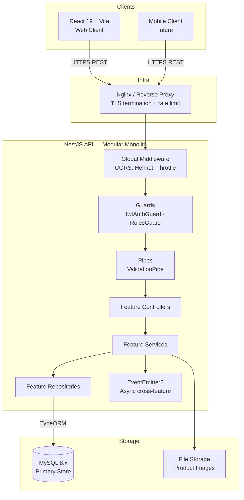
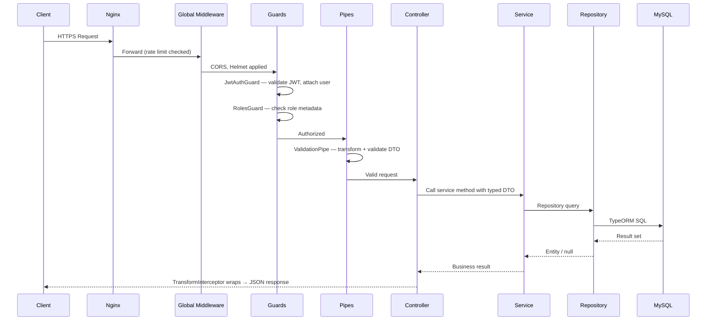
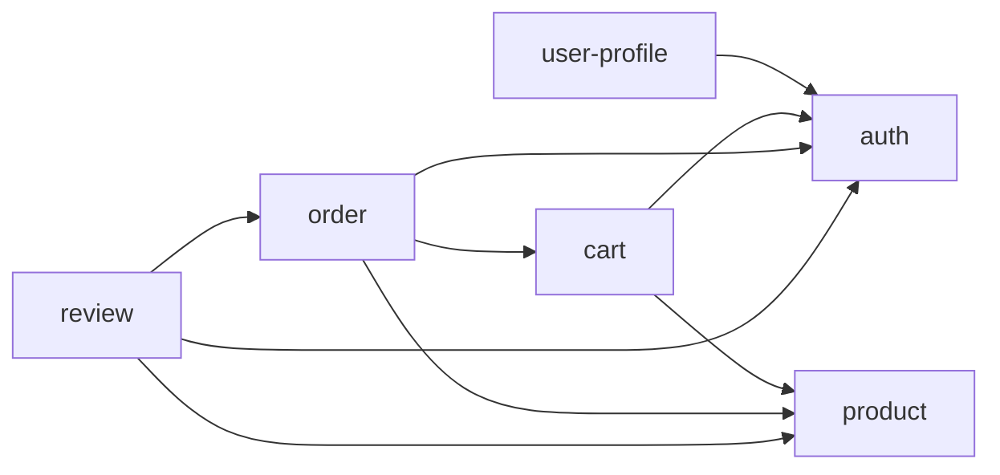

# Backend Architecture

## System Overview



**Architecture:** Monolith with feature-based modules.

| Decision | Rationale |
|----------|-----------|
| Modular monolith over microservices | Team size and complexity do not justify distributed system overhead at this stage |
| Feature-based modules | Each NestJS module = one domain boundary; self-contained, independently testable |
| Monolith-first | Clean module boundaries now make microservice extraction straightforward later if needed |

---

## Folder Structure

```
src/
├── main.ts                             # Bootstrap: global pipes, filters, interceptors, Swagger
├── app.module.ts                       # Root module — imports all feature + core modules
│
├── config/                             # Environment config — no raw process.env outside here
│   ├── app.config.ts                   # PORT, NODE_ENV
│   ├── database.config.ts              # DB host, port, name, credentials
│   └── jwt.config.ts                   # JWT secret, access expiry, refresh expiry
│
├── core/                               # Infrastructure setup — no business logic
│   ├── database/
│   │   └── database.module.ts          # TypeORM forRootAsync — reads database.config.ts
│   └── logger/
│       └── logger.module.ts            # Custom logger (structured JSON output)
│
├── shared/                             # Cross-feature, reusable code
│   ├── decorators/
│   │   ├── current-user.decorator.ts   # @CurrentUser() — extract user from JWT context
│   │   ├── roles.decorator.ts          # @Roles('admin') — sets role metadata
│   │   └── public.decorator.ts         # @Public() — bypass JwtAuthGuard
│   ├── filters/
│   │   └── http-exception.filter.ts    # Converts all HttpExceptions to standard error envelope
│   ├── guards/
│   │   ├── jwt-auth.guard.ts           # Validates JWT, populates request.user
│   │   └── roles.guard.ts             # Checks request.user.role against @Roles() metadata
│   ├── interceptors/
│   │   ├── transform.interceptor.ts    # Wraps success responses in standard envelope
│   │   └── logging.interceptor.ts      # Logs request method, path, duration, status
│   ├── pipes/
│   │   └── validation.pipe.ts          # Configured ValidationPipe (whitelist, transform)
│   ├── utils/
│   │   ├── pagination.util.ts          # buildPaginationMeta(), buildPaginationQuery()
│   │   └── hash.util.ts                # hashToken() — SHA-256; hashPassword() — bcrypt
│   └── types/
│       ├── api-response.type.ts        # ApiResponse<T>, PaginatedResponse<T>
│       ├── pagination.type.ts          # PaginationQuery, PaginationMeta
│       └── jwt-payload.type.ts         # IUserPayload — shape of JWT claims
│
└── features/
    ├── auth/                           # Owns: roles, users, refresh_tokens
    ├── user-profile/                   # Owns: addresses
    ├── product/                        # Owns: categories, products, variants, images
    ├── cart/                           # Owns: carts, cart_items
    ├── order/                          # Owns: orders, order_items, checkout logic
    └── review/                         # Owns: reviews
```

---

## Feature Anatomy

### Simple Feature: `auth`

```
features/auth/
├── auth.module.ts                      # Imports JwtModule, PassportModule; exports JwtAuthGuard
├── auth.controller.ts                  # Routes: /auth/*
├── auth.service.ts                     # Business: register, login, refresh, logout
├── repositories/
│   ├── user.repository.ts
│   ├── role.repository.ts
│   └── refresh-token.repository.ts
├── dto/
│   ├── register.dto.ts
│   ├── login.dto.ts
│   ├── refresh-token.dto.ts
│   └── auth-response.dto.ts
├── entities/
│   ├── user.entity.ts
│   ├── role.entity.ts
│   └── refresh-token.entity.ts
├── strategies/
│   └── jwt.strategy.ts                 # Passport JWT strategy — validates token, returns user
├── types/
│   └── jwt-payload.type.ts
├── tests/
│   ├── auth.service.spec.ts
│   └── auth.controller.spec.ts
└── CONTEXT.md
```

### Complex Feature: `product` (multiple sub-resources)

```
features/product/
├── product.module.ts
├── controllers/
│   ├── category.controller.ts          # /categories/*
│   ├── product.controller.ts           # /products/*
│   └── product-variant.controller.ts   # /variants/*
├── services/
│   ├── category.service.ts
│   ├── product.service.ts
│   └── product-variant.service.ts
├── repositories/
│   ├── category.repository.ts
│   ├── product.repository.ts
│   ├── product-variant.repository.ts
│   └── product-image.repository.ts
├── entities/
│   ├── category.entity.ts
│   ├── product.entity.ts
│   ├── product-variant.entity.ts
│   └── product-image.entity.ts
├── dto/
├── tests/
└── CONTEXT.md
```

### Feature with Transaction Logic: `order`

```
features/order/
├── order.module.ts                     # Imports ProductModule, CartModule
├── order.controller.ts                 # GET /orders, GET /orders/:id, PATCH /orders/:id/cancel
├── services/
│   ├── order.service.ts                # Read operations, status management
│   └── checkout.service.ts             # Cart → Order conversion — owns the transaction
├── repositories/
│   ├── order.repository.ts
│   └── order-item.repository.ts
├── entities/
│   ├── order.entity.ts
│   └── order-item.entity.ts
├── types/
│   ├── order-status.type.ts
│   └── payment-status.type.ts
├── tests/
└── CONTEXT.md
```

---

## Request Lifecycle



### Layer Responsibilities

| Layer | Responsibility | Must NOT |
|-------|----------------|----------|
| Controller | Route mapping, DTO binding, extract path/query params, format response | Contain business logic |
| Service | Business logic, orchestration, transactions, cross-feature coordination | Execute raw queries |
| Repository | TypeORM queries, custom query builders | Contain business logic |
| Guard | Authenticate + authorize request | Interact with business domain |
| Pipe | Transform and validate input | Reject valid business logic |
| Filter | Convert exceptions to error envelope | Swallow exceptions |
| Interceptor | Wrap responses, log request lifecycle | Alter business output |

### Checkout Flow (Illustrative Multi-Step Transaction)

```
POST /orders/checkout
  ↓ JwtAuthGuard — validates token
  ↓ ValidationPipe — validates CreateOrderDto
  ↓ OrderController.checkout()
  ↓ CheckoutService.execute(userId, dto)
      1. Load cart + items (CartRepository)
      2. Validate cart is not empty (throw CART_002 if empty)
      3. Load product variants + lock rows (SELECT FOR UPDATE)
      4. Validate stock for each item (throw PROD_003 if insufficient)
      5. BEGIN TRANSACTION (QueryRunner)
          a. Deduct stock_quantity for each variant
          b. Snapshot shipping address from addressId
          c. Create order record
          d. Create order_items with snapshots
          e. Clear cart items
      6. COMMIT
      7. Emit 'order.created' event (async: send email, update analytics)
  ↓ Return OrderResponseDto
```

---

## Cross-Feature Communication

### Dependency Graph



### Allowed Communication Patterns

```typescript
// ✅ PATTERN 1: NestJS module import + DI (synchronous)
// order.module.ts
@Module({
  imports: [
    ProductModule,   // provides ProductVariantRepository
    CartModule,      // provides CartRepository
  ],
  providers: [OrderService, CheckoutService],
})
export class OrderModule {}

// ✅ PATTERN 2: EventEmitter2 (async, decoupled side effects)
// order.service.ts — after successful checkout
this.eventEmitter.emit('order.created', {
  orderId: order.id,
  userId: order.userId,
  totalAmount: order.totalAmount,
});

// notification.listener.ts — in a notification feature (or shared listener)
@OnEvent('order.created')
async handleOrderCreated(payload: OrderCreatedEvent) {
  await this.emailService.sendOrderConfirmation(payload);
}

// ❌ FORBIDDEN: Direct cross-feature internal imports
import { UserService } from '../auth/auth.service';            // WRONG
import { Product } from '../product/entities/product.entity'; // WRONG — only via module export
```

---

## Shared vs Core Distinction

| Layer | Location | Contains | Example |
|-------|----------|----------|---------|
| Shared | `src/shared/` | Business-adjacent reusable utilities | Guards, interceptors, decorators, pagination utils |
| Core | `src/core/` | Infrastructure plumbing | TypeORM connection module, logger setup |
| Config | `src/config/` | Typed environment config | `AppConfig`, `DatabaseConfig`, `JwtConfig` |

**Decision rule:** If it needs `ConfigService` or `DataSource` — it's Core. If it's used by 2+ features without touching infra — it's Shared.

---

## Configuration Management

### Environment Variables

```bash
# Application
PORT=3000
NODE_ENV=development    # development | production | test

# Database
DB_HOST=localhost
DB_PORT=3306
DB_USERNAME=root
DB_PASSWORD=secret
DB_NAME=ecommerce_db

# JWT
JWT_SECRET=minimum-32-char-random-string
JWT_EXPIRES_IN=15m
JWT_REFRESH_EXPIRES_IN=7d
```

### Typed Config Pattern

```typescript
// config/database.config.ts
export default registerAs('database', () => ({
  host: process.env.DB_HOST || 'localhost',
  port: parseInt(process.env.DB_PORT ?? '3306', 10),
  username: process.env.DB_USERNAME,
  password: process.env.DB_PASSWORD,
  name: process.env.DB_NAME,
}));

// Usage — never call process.env in feature code
@Injectable()
export class SomeService {
  constructor(private readonly config: ConfigService) {}

  getDbHost(): string {
    return this.config.get<string>('database.host');
  }
}
```

### Secrets Handling

| Rule | Detail |
|------|--------|
| `.env` | Gitignored — never committed |
| `.env.example` | Committed — all keys documented, no real values |
| Production | Environment variables injected via CI/CD pipeline or secret manager |
| JWT secret | Minimum 32 characters of cryptographic randomness |
| DB password | Rotated per environment; never shared across environments |

---

## Global Bootstrap (`main.ts`)

```typescript
async function bootstrap() {
  const app = await NestFactory.create(AppModule, {
    logger: ['log', 'warn', 'error'],
  });

  // Security
  app.use(helmet());
  app.enableCors({ origin: process.env.CORS_ORIGIN, credentials: true });

  // Global middleware chain (order matters)
  app.useGlobalPipes(
    new ValidationPipe({
      transform: true,
      whitelist: true,
      forbidNonWhitelisted: true,
    }),
  );
  app.useGlobalFilters(new HttpExceptionFilter());
  app.useGlobalInterceptors(new LoggingInterceptor(), new TransformInterceptor());

  // API prefix
  app.setGlobalPrefix('api/v1');

  // Swagger (disable in production)
  if (process.env.NODE_ENV !== 'production') {
    const config = new DocumentBuilder()
      .setTitle('E-Commerce API')
      .setVersion('1.0')
      .addBearerAuth()
      .build();
    SwaggerModule.setup('docs', app, SwaggerModule.createDocument(app, config));
  }

  await app.listen(process.env.PORT ?? 3000);
}
```

---

## Operational Notes

| Concern | Guidance |
|---------|----------|
| Health check | Expose `GET /api/v1/health` — returns DB connectivity + app uptime |
| Graceful shutdown | Handle `SIGTERM` — drain in-flight requests before closing DB connections |
| Refresh token cleanup | Scheduled job: `DELETE WHERE expires_at < NOW() OR is_revoked = TRUE` — run nightly |
| Request logging | Log method, path, status code, duration (ms), userId — structured JSON |
| Error monitoring | Integrate Sentry or equivalent in production — capture unhandled exceptions |
| Database migrations | Run `typeorm migration:run` as part of deployment pipeline, before app startup |
