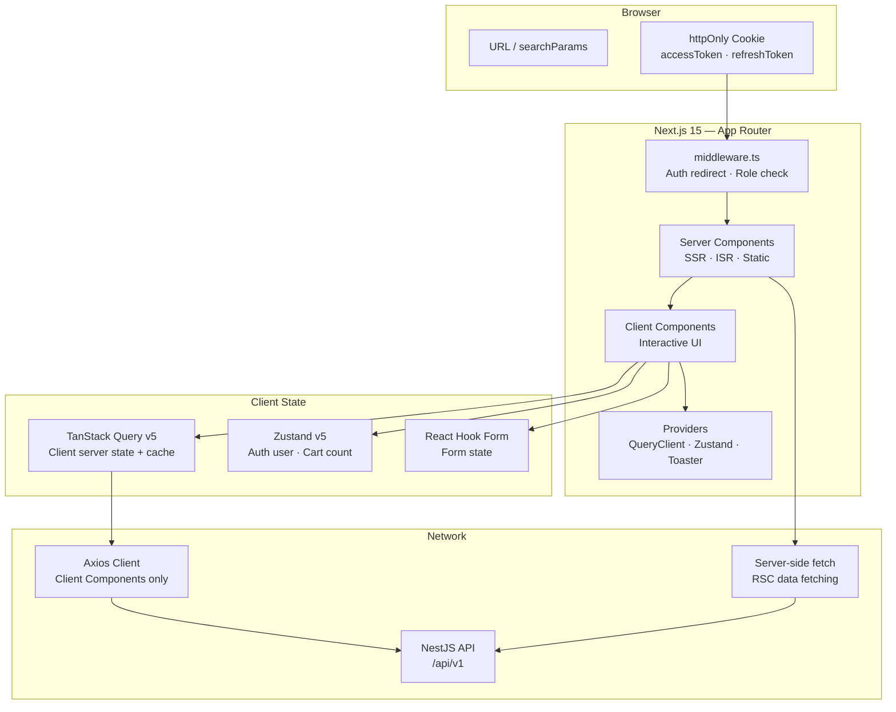
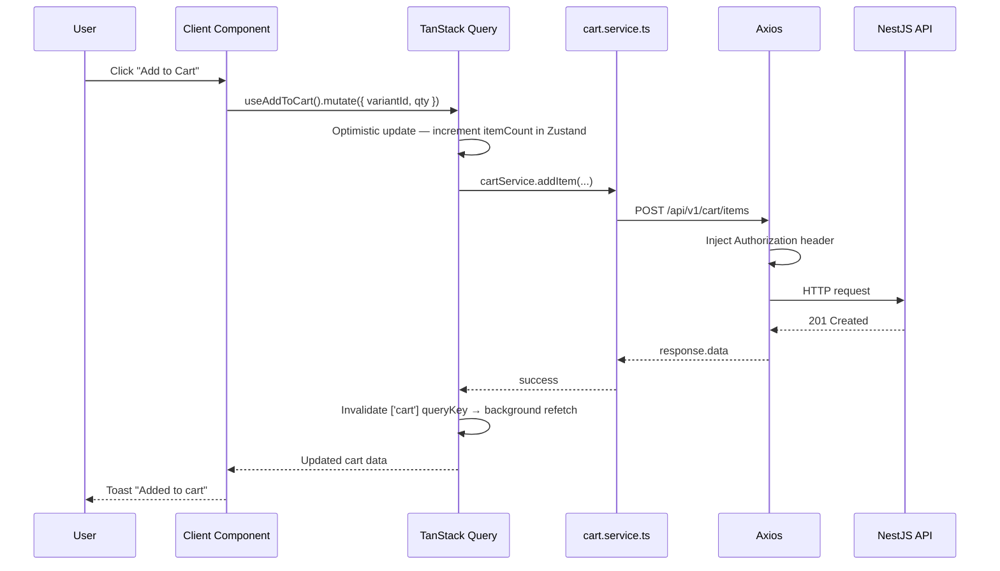
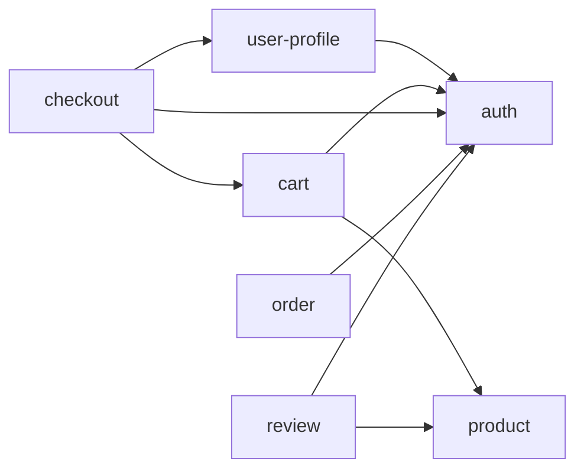

# Frontend Architecture

## Overview



**Architecture:** Next.js 15 App Router with feature-based modules. Server Components handle data fetching and static rendering by default. Client Components are scoped to interactive UI only.

### Tech Stack Justification

| Technology | Why Chosen | Key Trade-off |
|------------|-----------|---------------|
| Next.js 15 App Router | SSR/ISR built-in, RSC, file-based routing, middleware | Steeper mental model (RSC vs CC boundary) |
| React 19 | Concurrent features, Actions, use() hook | New patterns require team upskilling |
| TypeScript strict | Compile-time safety for RSC/CC prop shapes | More verbose than JS |
| TanStack Query v5 | Client-side caching, background refetch, optimistic updates | Only used in Client Components |
| Zustand v5 | Minimal global state (auth user, cart count) — no Provider wrap | Requires discipline — don't overuse |
| React Hook Form + Zod | Schema-first validation, minimal re-renders | Two libraries for one concern (acceptable) |
| Tailwind CSS v4 | Utility-first, consistent, responsive by default | Class verbosity — mitigate with component extraction |

---

## Folder Structure

```
src/
├── app/                                # Next.js App Router — all routing here
│   ├── layout.tsx                      # Root layout: Providers, global CSS
│   ├── page.tsx                        # Home page (RSC)
│   ├── not-found.tsx                   # Global 404 page
│   ├── error.tsx                       # Global error boundary (Client Component)
│   │
│   ├── (public)/                       # Route group — public, no auth check
│   │   ├── products/
│   │   │   ├── page.tsx                # RSC: fetch + render product list
│   │   │   └── [slug]/
│   │   │       ├── page.tsx            # RSC: fetch product detail
│   │   │       └── loading.tsx         # Streaming skeleton while RSC fetches
│   │   └── categories/
│   │       └── [slug]/
│   │           └── page.tsx
│   │
│   ├── (auth)/                         # Route group — login/register
│   │   ├── layout.tsx                  # Centered card layout
│   │   ├── login/
│   │   │   └── page.tsx               # RSC shell + LoginForm (Client)
│   │   └── register/
│   │       └── page.tsx
│   │
│   ├── (protected)/                    # Route group — auth required (middleware)
│   │   ├── layout.tsx                  # Hydrate auth state, session check
│   │   ├── cart/page.tsx
│   │   ├── checkout/page.tsx
│   │   ├── orders/
│   │   │   ├── page.tsx               # RSC: fetch order list
│   │   │   └── [id]/page.tsx          # RSC: fetch order detail
│   │   └── profile/page.tsx
│   │
│   └── admin/                          # Admin section — role check in middleware
│       ├── layout.tsx
│       ├── products/page.tsx
│       └── orders/page.tsx
│
├── middleware.ts                        # Edge middleware: auth redirect + role guard
│
├── features/
│   ├── auth/
│   ├── user-profile/
│   ├── product/
│   ├── cart/
│   ├── checkout/
│   ├── order/
│   └── review/
│
├── shared/
│   ├── components/
│   │   ├── ui/                         # Button, Input, Modal, Badge, Table
│   │   ├── feedback/                   # Toast, Skeleton, EmptyState
│   │   └── layout/                     # Header, Footer, PageWrapper
│   ├── hooks/                          # Client-only: useDebounce, useLocalStorage
│   ├── lib/
│   │   ├── axios.ts                    # Axios instance + interceptors (client-only)
│   │   ├── fetch.ts                    # serverFetch() wrapper for RSC
│   │   └── queryClient.ts              # TanStack QueryClient config
│   ├── types/                          # ApiResponse<T>, PaginatedResponse<T>
│   └── utils/                          # formatPrice, formatDate, cn()
│
└── assets/                             # Images, fonts, SVGs
```

---

## Feature Anatomy

### Auth Feature

```
features/auth/
├── components/
│   ├── LoginForm.tsx           # 'use client' — RHF + Zod + useLogin mutation
│   └── RegisterForm.tsx        # 'use client'
├── hooks/
│   ├── useLogin.ts             # 'use client' — useMutation → POST /auth/login
│   ├── useRegister.ts          # 'use client' — useMutation → POST /auth/register
│   └── useLogout.ts            # 'use client' — useMutation → POST /auth/logout
├── services/
│   └── auth.service.ts         # Client-side: login(), register(), logout()
├── stores/
│   └── auth.store.ts           # Zustand: { user, isAuthenticated, setAuth, logout }
├── types/
│   └── auth.types.ts
└── index.ts                    # exports: { useAuthStore, LoginForm, RegisterForm }
```

### Product Feature

```
features/product/
├── components/
│   ├── ProductCard.tsx         # 'use client' — add-to-cart button interaction
│   ├── ProductList.tsx         # 'use client' — receives initialData from RSC
│   ├── ProductFilters.tsx      # 'use client' — updates URL searchParams
│   ├── VariantSelector.tsx     # 'use client' — local state for selected variant
│   └── ProductDetailClient.tsx # 'use client' — composes gallery + selector + cart CTA
├── hooks/
│   ├── useProducts.ts          # 'use client' — useQuery with initialData hydration
│   └── useProductDetail.ts     # 'use client' — useQuery
├── services/
│   ├── product.service.ts      # Client-side Axios calls
│   └── product.server.ts       # Server-side: serverFetch() for RSC pages
├── types/
│   └── product.types.ts        # Shared — usable in RSC and Client
└── index.ts
```

### Cart Feature

```
features/cart/
├── components/
│   ├── CartIcon.tsx            # 'use client' — reads itemCount from Zustand
│   ├── CartDrawer.tsx          # 'use client' — slide-over, lists cart items
│   └── CartItem.tsx            # 'use client' — qty controls + remove button
├── hooks/
│   ├── useCart.ts              # 'use client' — useQuery: GET /cart
│   ├── useAddToCart.ts         # 'use client' — useMutation, optimistic update
│   ├── useUpdateCartItem.ts    # 'use client' — useMutation: PATCH /cart/items/:id
│   └── useRemoveCartItem.ts    # 'use client' — useMutation: DELETE /cart/items/:id
├── stores/
│   └── cart.store.ts           # Zustand: { itemCount } for header badge
├── services/
│   └── cart.service.ts
└── index.ts                    # exports: { CartIcon, CartDrawer, useCart, useAddToCart }
```

---

## Rendering Strategy

Choosing the right rendering mode per route is the most impactful performance decision.

| Route | Strategy | Reason |
|-------|----------|--------|
| `/products` | ISR (`revalidate: 60`) | Public catalog — SEO critical, changes periodically |
| `/products/[slug]` | ISR (`revalidate: 300`) | Product detail — SEO + infrequent changes |
| `/categories/[slug]` | ISR (`revalidate: 300`) | Category pages — SEO |
| `/orders`, `/orders/[id]` | SSR (no cache) | User-specific, must be fresh |
| `/checkout` | SSR (no cache) | Real-time stock + address data |
| `/profile` | SSR (no cache) | User-specific |
| `/login`, `/register` | Static | No data dependency |
| `/admin/*` | SSR (no cache) | Admin data must be real-time |

```tsx
// ISR example — product listing
export default async function ProductListPage({ searchParams }: Props) {
  const data = await serverFetch<PaginatedResponse<Product>>(
    `/products?page=${searchParams.page ?? 1}`,
    { next: { revalidate: 60 } },
  );
  return <ProductList initialData={data} />;
}

// SSR example — order detail (no cache)
export default async function OrderDetailPage({ params }: { params: { id: string } }) {
  const order = await serverFetch<ApiResponse<Order>>(`/orders/${params.id}`, {
    cache: 'no-store',
  });
  return <OrderDetail order={order.data} />;
}

// Static — login page
export default function LoginPage() {
  return <LoginForm />;
}
```

---

## Data Flow

### RSC Data Flow (Server → Client Hydration)

```
URL Request
  ↓
middleware.ts — auth/role check
  ↓
app/(public)/products/page.tsx (RSC)
  ↓
serverFetch('/products', { next: { revalidate: 60 } })
  ↓
NestJS API → response JSON
  ↓
RSC renders HTML + serializes initialData as props
  ↓
Browser receives pre-rendered HTML (fast LCP, SEO ready)
  ↓
React hydrates → ProductList Client Component mounts
  ↓
TanStack Query receives initialData → no extra network request on mount
  ↓
User interacts → TanStack Query refetches in background after staleTime
```

### Client Mutation Flow (Cart Add)



### Checkout Flow

```
1. User navigates to /checkout
   → middleware.ts: check accessToken cookie → allow
   → RSC: serverFetch('/addresses', { cache: 'no-store' }) for address list

2. CheckoutPage RSC renders → passes addresses as props to CheckoutForm (Client)

3. CheckoutForm (Client Component):
   a. RHF + Zod validation
   b. User selects address + payment method
   c. Submit → useCheckout().mutate(data)

4. useCheckout mutation:
   → POST /api/v1/orders/checkout via Axios
   → On success:
       - queryClient.invalidateQueries(['cart'])
       - cart.store.setItemCount(0)
       - router.push('/orders/' + orderId)
   → On error:
       - toast.error(error.code + ': ' + error.message)
       - form stays populated for correction
```

---

## Route Protection — Middleware

```ts
// middleware.ts
import { NextResponse } from 'next/server';
import type { NextRequest } from 'next/server';
import { jwtDecode } from 'jwt-decode';
import type { IUserPayload } from '@/shared/types';

const PROTECTED = ['/cart', '/checkout', '/orders', '/profile'];
const ADMIN_ONLY = ['/admin'];

export function middleware(request: NextRequest) {
  const { pathname } = request.nextUrl;
  const token = request.cookies.get('accessToken')?.value;

  const needsAuth = PROTECTED.some((p) => pathname.startsWith(p));
  const needsAdmin = ADMIN_ONLY.some((p) => pathname.startsWith(p));

  if ((needsAuth || needsAdmin) && !token) {
    const loginUrl = new URL('/login', request.url);
    loginUrl.searchParams.set('redirect', pathname);
    return NextResponse.redirect(loginUrl);
  }

  if (needsAdmin && token) {
    try {
      const payload = jwtDecode<IUserPayload>(token);
      if (payload.role !== 'admin') {
        return NextResponse.redirect(new URL('/', request.url));
      }
    } catch {
      return NextResponse.redirect(new URL('/login', request.url));
    }
  }

  return NextResponse.next();
}

export const config = {
  matcher: [
    '/cart/:path*',
    '/checkout/:path*',
    '/orders/:path*',
    '/profile/:path*',
    '/admin/:path*',
  ],
};
```

> **Edge runtime:** `middleware.ts` runs on the Edge runtime. Do not use Node.js-only APIs (`fs`, `crypto`). Use `jwt-decode` (pure JS) for token inspection — full JWT verification happens on the NestJS server.

---

## State Management Architecture

| State Type | Tool | Location | Example |
|------------|------|----------|---------|
| Server state (client-interactive) | TanStack Query | Client Component | Cart, user reviews |
| Server state (SSR/ISR) | `serverFetch` + RSC | Server Component | Product list, order history |
| Auth user info | Zustand (partial persist) | Global client | `user`, `isAuthenticated` |
| Cart badge count | Zustand (persist) | Global client | `itemCount` in header |
| URL / filter state | `searchParams` (RSC) or `useSearchParams` (CC) | Page-scoped | `?page=2&category_id=5` |
| Form state | React Hook Form | Component-scoped | Checkout, login, review forms |
| Local UI | `useState` | Component-scoped | Modal, dropdown open/close |

### Zustand Auth Store

```ts
// features/auth/stores/auth.store.ts
'use client';

interface AuthState {
  user: AuthUser | null;
  isAuthenticated: boolean;
  setAuth: (user: AuthUser) => void;
  logout: () => void;
}

export const useAuthStore = create<AuthState>()(
  persist(
    (set) => ({
      user: null,
      isAuthenticated: false,
      setAuth: (user) => set({ user, isAuthenticated: true }),
      logout: () => set({ user: null, isAuthenticated: false }),
    }),
    {
      name: 'auth-store',
      partialize: (state) => ({ user: state.user }), // persist user info only
    },
  ),
);
```

> **Token strategy:** `accessToken` is stored in an **httpOnly cookie** set by the NestJS server — not accessible to JavaScript. Zustand persists only the `user` object for UI display. On page refresh, the middleware validates the cookie server-side; TanStack Query fetches fresh data client-side.

---

## API Layer

```
shared/lib/fetch.ts              ← Server-side: used by RSC pages for SSR/ISR
    ↓
app/(public)/products/page.tsx   ← RSC: fetch → pass as props to Client Component

shared/lib/axios.ts              ← Client-side: Axios instance + 401 auto-refresh interceptor
    ↓
features/[x]/services/           ← Typed API functions (client)
[x].service.ts
    ↓
features/[x]/hooks/              ← TanStack Query wrappers
use[X].ts
    ↓
features/[x]/components/         ← Consume hook → render UI
[X].tsx ('use client')
```

### Cache Invalidation

```ts
// After checkout — invalidate cart query + reset badge
const checkout = useMutation({
  mutationFn: checkoutService.createOrder,
  onSuccess: (data) => {
    queryClient.invalidateQueries({ queryKey: ['cart'] });
    useCartStore.getState().setItemCount(0);
    router.push(`/orders/${data.data.id}`);
  },
  onError: (error) => {
    toast.error(error.response?.data?.error?.message ?? 'Checkout failed');
  },
});

// After review creation — invalidate product reviews
const createReview = useMutation({
  mutationFn: reviewService.create,
  onSuccess: (_, variables) => {
    queryClient.invalidateQueries({ queryKey: ['reviews', variables.productId] });
  },
});
```

---

## Cross-Feature Communication



| Method | When to Use | Example |
|--------|-------------|---------|
| Barrel import (`index.ts`) | Feature A needs component/hook from Feature B | `import { CartIcon } from '@/features/cart'` |
| Zustand global store | Auth state visible everywhere, cart count in header | `useAuthStore()`, `useCartStore()` |
| URL `searchParams` (RSC) | Server-side filter / pagination state | `?page=2&category_id=5` |
| `useSearchParams` (Client) | Client-side filter updates without full navigation | Update URL without hard reload |
| TanStack Query cache | Shared server data across components | `queryClient.getQueryData(['product', slug])` |

---

## Shared vs Feature Boundary

| Belongs in `shared/` | Belongs in `features/` |
|----------------------|------------------------|
| Button, Input, Modal, Badge | ProductCard, CartItem, CheckoutForm |
| `useDebounce`, `useLocalStorage` | `useProducts`, `useCart`, `useCheckout` |
| `apiClient` (Axios), `serverFetch` | `product.service.ts`, `cart.service.ts` |
| `ApiResponse<T>`, `PaginatedResponse<T>` | `Product`, `CartItem`, `Order` types |
| `formatPrice`, `formatDate`, `cn()` | `buildProductFilterQuery` |
| Skeleton, Spinner, ErrorBoundary | `ProductSkeleton`, `CartItemSkeleton` |
| `useAuthStore`, `useCartStore` (global) | Feature-local store slices |

**Decision rule:** If 2+ features import it → `shared/`. If 1 feature owns it → keep in feature.

---

## Performance Considerations

| Concern | Strategy |
|---------|----------|
| Initial page load / LCP | RSC + ISR for public pages — pre-rendered HTML, no client JS for data fetching |
| SEO (product, category pages) | RSC ensures content is in HTML before hydration |
| Bundle size | `'use client'` boundary is surgical — only interactive components ship JS |
| Image optimization | Use `next/image` — automatic WebP conversion, lazy loading, responsive sizes |
| Font loading | `next/font` — self-hosted, no layout shift |
| Prefetching | Next.js `<Link>` prefetches visible routes automatically |
| Search input debounce | `useDebounce(query, 400)` before triggering `setSearchParams` |
| Long lists | `@tanstack/react-virtual` for virtualized product grids |
| Category tree | Long `revalidate` (3600s) — categories rarely change |

---

## Operational Notes

| Concern | Guidance |
|---------|----------|
| Environment variables | `NEXT_PUBLIC_*` → exposed to client. Non-prefixed → server only. Never put secrets in `NEXT_PUBLIC_*` |
| `API_BASE_URL` | Server-side only (in `serverFetch`). `NEXT_PUBLIC_API_BASE_URL` for client Axios |
| Error boundaries | Use `error.tsx` per route segment for RSC errors; `ErrorBoundary` component for client errors |
| Streaming | Use `loading.tsx` + `Suspense` for progressive streaming of slow RSC data |
| Build output | `next build` — check bundle analyzer for unexpected large client chunks |
| Deployment | `next start` (Node.js server) or Docker with `output: 'standalone'` in `next.config.ts` |
